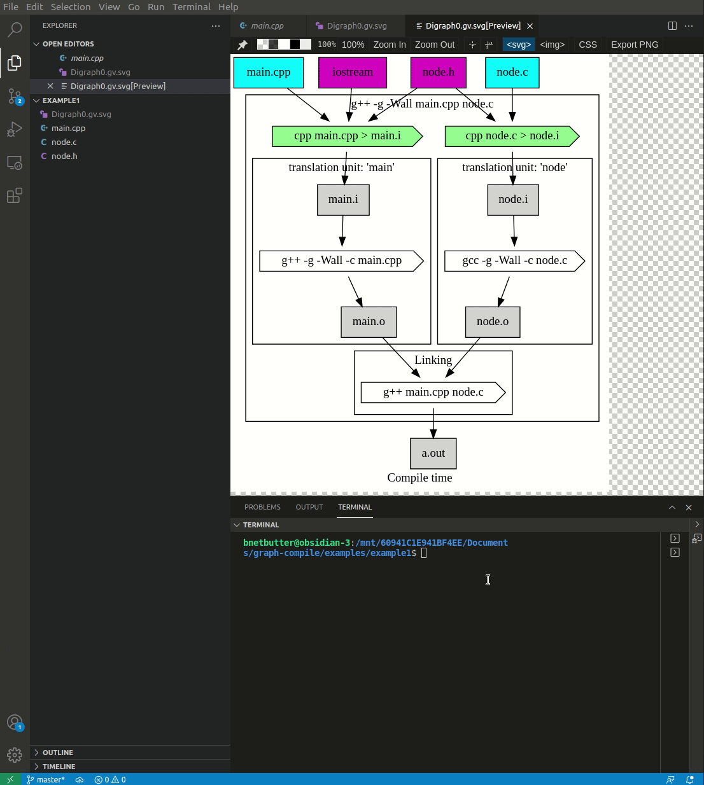

# compile-graph

A simple graphing utility that generates a dependency graph of C/C++ source files. The graph breaks down stages of compilation into preprocessing, compiling, and linking and can be displayed interactively. Then follow the graph to generate the intermediate files. This utility is meant to help beginner C/C++ programmers quickily understand stages of compilation and where compile time errors are likely to occur.

```
pip3 install compile-graph
```

The repo contains several examples. From the root directory...

```bash
cd examples/example1
compile-graph -i
```



### Wishlist
Code to extract symbols from object dumps of .o files exist within compile_graph.py. It may be used to examine the affect of `extern "C"`
on the ABI.